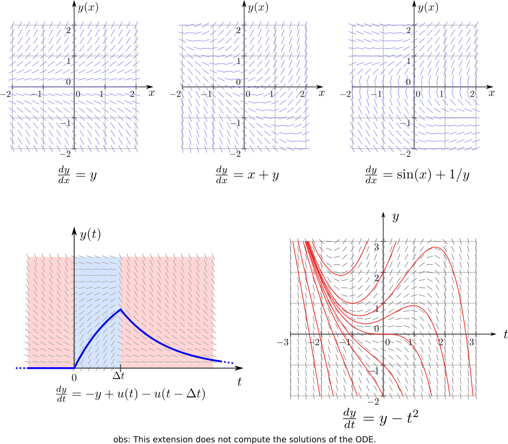

# inkscapeSlopeField
 Extension to create slope fields of first order ordinary differential equations (ODEs)



### main features

The main features are

 - generate the slope field plot of a first order ODE
 - optional grid lines in X and Y directions
 - adjustable tick mark intervals and sizes
 - LaTeX support
 - adjustable density of segments

# Installation and requirements

This extension was partially developed in Inkscape 0.48 and partially in 0.91 in Linux (Kubuntu 12.04 and 14.04).
It should work on both versions of Inkscape. Also, they should work in different OSs too as long as all requirements are installed.

This extension requires another extension to run, inkscapeMadeEasy <https://github.com/fsmMLK/inkscapeMadeEasy>,
which contains several backstage methods and classes.

In order to use inkscapeSlopeField extension, you must also download inkscapeMadeEasy files and put them inside Inkscape's
 extension directory. Please refer to inkscapeMadeEasy installation instructions. In the end you must have the following files and directories in your Inkscape extension directory.

```
inkscape/extensions/
            |-- inkscapeMadeEasy_Base.py
            |-- inkscapeMadeEasy_Draw.py
            |-- inkscapeMadeEasy_Plot.py
            |-- textextLib
            |   |-- __init__.py
            |   |-- basicLatexPackages.tex
            |   |-- textext.inx
            |   |-- textext.py
            |
            |-- slopeField.py
            `-- slopeField.inx
```

**Disabling LaTeX support of inkscapeMadeEasy**

Many of the methods implemented in inkscapeMadeEasy project use LaTeX to generate text. To this end I decided to employ the excellent extension **textext** from Pauli Virtanen  <https://pav.iki.fi/software/textext/>. 

LaTeX support via textext extension requires LaTeX typesetting system in your computer (it's free and awesome! =] ).

Since many people don't use LaTeX and/or don't have it installed, inkscapeMadeEasy's LaTeX support is now optional. **By default, LaTeX support is ENABLED.**

Please refer to <https://fsmmlk.github.io/inkscapeMadeEasy/#installation-and-requirements> on how to easily disable LaTeX support.


# Usage

The extension can be found under `extensions > fsmMLK > Plot 2D > Cartesian` menu.

This extension is presented in three tabs, **Slope function data**,  **Axes configuration** and **Segment config
**. The first is used to
 define the slope field equation and ranges. The second is used to configure the axes and the third is used to configure
  the slope segment indications.

### The slope function data tab


Here you specify the slope function and set both independent and dependent variable ranges.

**dy/dx:** Slope function equation. This must be a python compatible expression. Your independent variable **MUST
** be `x` and dependent variable **MUST** be `y`.

The slope equation `f(x,y)` can be found isolating dy/dx in the ODE like the example below. The slope equation is, in
 general, a function of both `x` and `y`. Some cases might be independent of  `x` or `y` or both (constant slope).


> Tip: This extension imports all method from 'math' module from python. Therefore you don have to specify the module name math.<some_method>.

> Example: to generate a sine function, just type `sin(x)`. You don't have to type `math.sin(x)`

**X/Y min and max:** Set the limits of the X and Y axes.
 
**General aspect factor:** General aspect ratio between line widths and text width. I designed this extension to have an overall aspect ratio that looked nice to my eyes. It is a function of X and Y tick lengths. With this control you can scale both line widths and text height to fit your needs.


### The Axes Configuration tab


**X/Y axis label:** label of the axes. This string must be LaTeX compatible. Any LaTeX commands or environments are valid. If you want to write in mathematical environment, enclose your text with $...$. You don't have to escape any backslashes.

> Tip: Since `siunitx` package is included in basicLatexPackages.tex file by default in inkscapeMadeEasy, you can use any unit command available there 

Ex: `Foobar $\sqrt{x^2}$ so fancy! (\si{\newton\per\squaremetre})`


**Add grid to X/Y axis:** Draw grid lines in X or Y axes. The grid lines will be placed at each tick mark

**Add ticks to X/Y axis:** Draw tick marks with associated values in X or Y axes.

**X/Y tick step:** Tick marks interval  in units of your chart.

Ex: limits from -1 to 1, with tick step of 0.5 will produce ticks at -1, -0.5, 0, 0.5, 1

> Note: The ticks will radiate from the origin x=0 or y=0 unless the origin does not lie within the limits. In such cases, the ticks will radiate starting from the  limit closest to the origin.
>
> Examples in x direction. The same rules apply to Y direction
>
> 


**X/Y tick length** The distance between the tick marks, in px.


**X/Y tick suffix value:** Optional extra suffix to be added to the tick values. You can use any LaTeX text/commands valid in mathematical environment $...$. You don't have to enclose your text between $...$. You don't have to escape any backslashes.


### The segment config tab


**Number of segments along X/Y:** Set the number of points where the slope is sampled in each axis. The samples will
 be equally sampled along the range in each axis.

**Segment aspect factor:** Extra aspect ratio parameter for adjusting the width of the slope segments only. Keep in mind
 that the `General aspect factor` parameter also affects the width of the segments.

**Color:** Color of the segments. You can select of the predefined colors as presented below, or select select 
**use color picker** to choose the color from the color picker widget just below the `Color` drop down menu.
 **Attention:** the color selected in the color picker widget will be considered **ONLY** if you select **use color
  picker** in the drop down menu.


# Observations

 - The axes will be placed crossing the origin (0,0) or crossing the coordinate (x,y) closest to the origin if the origin does not lies within the limits.
 - The axes will be created at the center of your screen.

# Special functions

Together with the extension I also predefined 3 new functions:

 - **Heaviside step function**

Calling: `u(x)`

Examples:


 - **Rectangular pulse**

Calling: `rectPulse(x,amplitude=1.0,length=1.0,offset=0.0,delay=0.0)`


 - **Square wave**

Calling: `squareWave(x,amplitude=1.0,offset=0,period=1.0,delay=0.0)`


> Tip: You can define your own functions at the beginning of the file `cartesianPlotFunction2D.py`


# Examples


