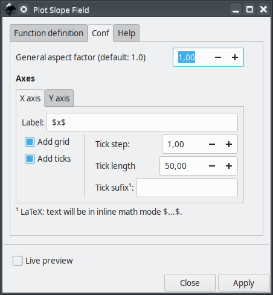

# slopeField

This extension will assist you creating slope fields of first order ordinary differential equations (ODEs) in [Inkscape](https://inkscape.org/).


### main features

The main features are

 - generate the slope field plot of a first order ODE
 - Optional grid lines in X and Y directions
 - Adjustable tick mark intervals and sizes
 - Optional LaTeX support
 - adjustable density of segments

**Important:** This extension does not solve the ODE.

## Current and older versions

Compatibility table

|  Inkscape        |  slopeField | inkscapeMadeEasy | Receive updates?|
|------------------|-----------------|------------------|-----------------|
|       1.0        | 1.0 (latest)    |   1.0 (latest)   | YES             |
| 0.48, 0.91, 0.92 | 0.9x (obsolete) |  0.9x (obsolete) | NO              |


**Latest version:** The latest version of **slopeField** is **1.0**. This version is compatible with Inkscape 1.0 and up only. It is **incompatible** with older Inkscape versions!

**Older versions:** If you have an older version of Inkscape, please use the files under the folder **0.9x** on Github.

**Important: Only the latest version will receive updates, new features, and bug fixes! The usage section in this documentation describes the latest version. In older versions, the disposition of the elements in the plugin's screen might be different. Some features might not be present or have different behavior.**

# Installation and requirements

Installation procedures for latest and older versions are described below.

## Requirements (all versions)

- You will need [inkscapeMadeEasy](https://github.com/fsmMLK/inkscapeMadeEasy) plugin installed. Check the compatibility table above to know the version you need.

## Installation procedure (v1.0 only)

**slopeField** was developed using Inkscape 1.0 in Linux (Kubuntu 18.04). It should work in different OSs too as long as all requirements are met.

1. Install [inkscapeMadeEasy](https://github.com/fsmMLK/inkscapeMadeEasy), **version 1.0** (latest). Follow the instructions in the manual page. **Note:** LaTeX text is used in **slopeField** if the support is activated (nicer results), otherwise regular text elements will be used.

2. **slopeField** installation

    1. Go to Inkscape's extension directory with a file browser. Your inkscape extension directory can be accessed by opening Inkscape and selecting ``Edit > Preferences > System``. Look for the item **User Extensions**  field. There is a button on the right of the field  that will open a file explorer window in that specific folder.

    2. Create a subfolder in the extension directory with the name ``slopeField``. **Important:**  Be careful with upper and lower case letters. You must write as presented above.

    3. Download **slopeField** files and place them inside the directory you just created.

       You don't have to copy all files from Github. The files you will need are inside the ``latest`` folder. In the end you must have the following files and directories in your Inkscape extension directory.

       **LaTeX users:** You can add macros to ``inkscapeMadeEasy/basicLatexPackages.tex``. In this case the same macros will be accessible by all plugins that employ inkscapeMadeEasy.

        ```
        inkscape
         ┣━━extensions
         ┋   ┣━━ inkscapeMadeEasy      <-- inkscapeMadeEasy folder
             ┃    ┣━━ inkscapeMadeEasy_Base.py
             ┃    ┣━━ inkscapeMadeEasy_Draw.py
             ┃    ┣━━ inkscapeMadeEasy_Plot.py
             ┃    ┗━━ basicLatexPackages.tex
             ┃
             ┣━━ textext               <-- texText folder (if you installed textText)
             ┃    ┋
             ┃
             ┣━━ slopeField            <-- slopeField folder
             ┋    ┣━━ slopeField.inx
                  ┗━━ slopeField.py
        
        NOTE: You might have other sub folders inside the extensions directory. They don't interfere with the plugin.
        ```

## Installation procedure (v0.9x only)

**slopeField** was developed using Inkscape 0.48 and 0.91 in Linux (Kubuntu 18.04). It should work in different OSs too as long as all requirements are met.

1. Install [inkscapeMadeEasy](https://github.com/fsmMLK/inkscapeMadeEasy), **version 1.0** (latest). Follow the instructions in the manual page. **Note:** LaTeX text is used in **slopeField** if the support is activated (nicer results), otherwise regular text elements will be used.

2. **slopeField** installation

    1. Go to Inkscape's extension directory with a file browser.

    2. Download **slopeField** files and place them inside the directory you just created.

       You don't have to copy all files from Github. The files you will need are inside the ``0.9x`` folder. In the end you must have the following files and directories in your Inkscape extension directory.

        ```
        inkscape
         ┣━━ extensions
         ┋    ┣━━ inkscapeMadeEasy_Base.py
              ┣━━ inkscapeMadeEasy_Draw.py
              ┣━━ inkscapeMadeEasy_Plot.py
              ┃
              ┣━━ textextLib
              ┃    ┣━━ __init__.py
              ┃    ┣━━ basicLatexPackages.tex
              ┃    ┣━━ textext.inx
              ┃    ┗━━ textext.py
              ┃
              ┣━━ slopeField.inx        <--   from repository folder 0.9x!
              ┗━━ slopeField.py         <--
        ```

# Usage

The extension can be found under `extensions > fsmMLK > Plot 2D > Cartesian` menu.

This extension is presented in two tabs, **Function definition** and **Conf**. The first is used to
 define the slope field equation, ranges, and segments configuration. The second is used to configure the axes

## Function Definition tab


Here you specify the slope function, set both independent and dependent variable ranges and adjust the density and size of the segments.

**dy/dx:** Slope function equation. This must be a python compatible expression. Your independent variable **MUST
** be `x` and dependent variable **MUST** be `y`.

The slope equation `f(x,y)` can be found isolating dy/dx in the ODE like the example below. The slope equation is, in
 general, a function of both `x` and `y`. Some cases might be independent of  `x` or `y` or both (constant slope).


> Tip: This extension imports all method from 'math' module from python. Therefore you don have to specify the module name math.<some_method>.

> Example: to generate a sine function, just type `sin(x)`. You don't have to type `math.sin(x)`

**X/Y limits:** Set the range of the independent (X) and dependent (Y) variables. On the side there are fields for the lower and upper limits.

### Segment config section

**Number of segments:** Set the number of points where the slope is sampled in each axis. The samples will
 be equally spaced in the ranges.

**Segment aspect factor:** Aspect ratio parameter for adjusting the width of the slope segments only. Keep in mind
 that the `General aspect factor` parameter also affects the width of the segments.

**Segment color:** Controls the color of the segments that compose the slope field.

  - You can select the predefined colors. They are presented below


  
  - You can select **use color picker** to choose the color from the color picker widget just to the right of the drop down menu. **Attention:** the color selected in the color picker widget will be considered **ONLY** if you select **use color picker** in the drop down menu. 


## Conf tab



**General aspect factor:** General aspect ratio between line widths and text height. I designed this extension to have an overall aspect ratio that "looks nice". It is a function of X and Y tick lengths. With this control you can scale both line width and text height. The defauls value is 1.0.


### Axes section

In this section you can control X and Y axes. They act on the axes the same way.


**Label:** label of the axes. If LaTeX support is activated and you want to write in mathematical environment, enclose your text with $...$.

> Tip: Since `siunitx` package is included in inkscapeMadeEasy's basicLatexPackages.tex, you can use any unit command available there too!

> Ex: `Foobar $\sqrt{x^2}$ so fancy! (\si{\newton\per\squaremetre})`


**Add grid:** Draw grid lines. The grid lines will be placed at the tick marks.

**Add ticks:** Draw tick marks with associated values. 

**Tick step:** Tick mark interval, in units of your chart.

Ex: limits from -1 to 1, with tick step of 0.5 will produce ticks at -1, -0.5, 0, 0.5, 1

> Note: The ticks will radiate from the origin (x=0 or y=0) unless the origin does not lie within the limits. In such cases, the ticks will radiate starting from the limit closest to the origin. See image below.
>
> Examples in x direction: (The same rules apply to Y direction)
>
> 


**Tick length** The distance between tick marks, in units of your canvas. See image below.


**Tick suffix:** Optional extra suffix to be added to tick text. **LaTeX support enabled**: You can use any LaTeX text/commands valid in mathematical environment. You don't have to enclose your text between $...$.

**Atention**: the values appended to tick mark text will NOT affect input/output limits!

 

# Observations

 - The axes will be placed crossing the origin (0,0) or crossing the coordinate (x,y) closest to the origin if the origin does not lies within the limits.
 - The axes will be created in the center of your screen.

# Special functions

Together with the extension, I also predefined 3 new functions:

 - **Heaviside step function**

Calling: `u(x)`

Examples:


 - **Rectangular pulse**

Calling: `rectPulse(x,amplitude=1.0,length=1.0,offset=0.0,delay=0.0)`


 - **Square wave**

Calling: `squareWave(x,amplitude=1.0,offset=0,period=1.0,delay=0.0)`


> Tip: You can define your own functions at the beginning of the file `cartesianPlotFunction2D.py`


